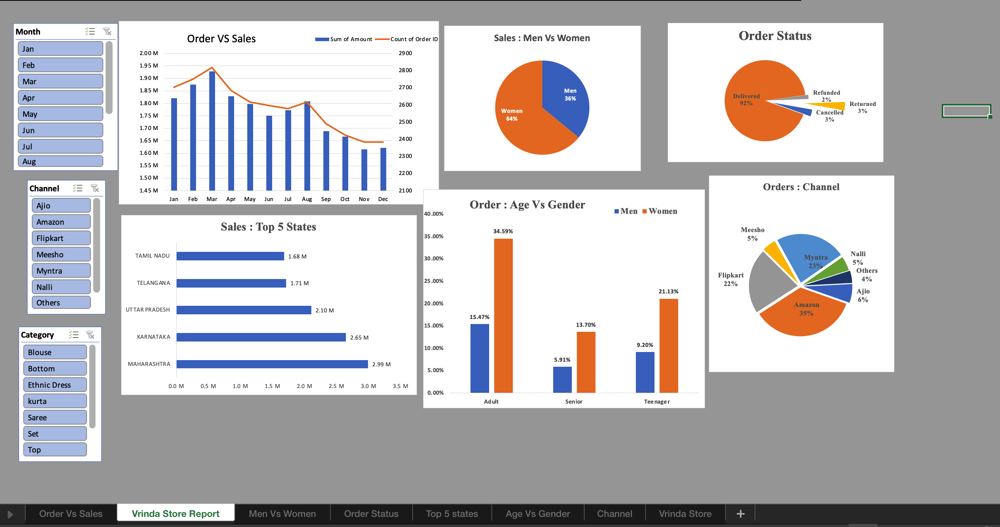

# 📊 Vrinda Store Sales Analysis

## 🔍 Project Overview

This project focuses on analyzing retail sales data of Vrinda Store using Microsoft Excel. The goal was to identify sales trends, customer behavior, and regional performance to support data-driven business decision-making.

---

## 🛠️ Tools & Technologies

* Microsoft Excel
* Pivot Tables & Pivot Charts
* Data Cleaning & Transformation
* Dashboard Design

---

## ⚙️ Process Followed

1. Cleaned raw sales data by handling missing values and inconsistencies
2. Transformed data by creating useful fields such as month and age groups
3. Used pivot tables to analyze sales across regions, categories, and customer segments
4. Built an interactive dashboard using pivot charts and slicers

---

## 📈 Business Problems Addressed

* Identifying peak sales months and order trends
* Understanding customer demographics (gender and age group)
* Analyzing regional sales performance
* Evaluating order delivery status
* Determining top-performing sales channels

---

## 📊 Key Insights

* Women contribute approximately **64%** of total sales
* Maharashtra, Karnataka, and Uttar Pradesh are the **top-performing states**
* Amazon (~35%), Flipkart (~22%), and Myntra (~23%) are the **major sales channels**
* Around **92% of orders are successfully delivered**
* Adult women contribute the highest share in total sales

---

## 📷 Dashboard Preview

---

## 📁 Dataset & Files

* `Vrinda Store Data Analysis.xlsx` → Contains cleaned data, pivot tables, and dashboards
* `dashboard.png` → Visual summary of key insights
* `README.md` → Project documentation

---

## 📌 Recommendations

* Focus marketing campaigns on women customers, especially the adult segment
* Increase product availability in top-performing states like Maharashtra and Karnataka
* Invest more in high-performing channels such as Amazon and Flipkart
* Improve operational strategies to reduce order cancellations and returns

---

## 🎯 Business Impact

* Helps identify high-performing regions and customer segments
* Supports marketing and inventory planning decisions
* Enables better sales strategy formulation
* Provides clear insights for business growth

---

## 🚀 Conclusion

This project demonstrates how Excel can be used for end-to-end data analysis—from data cleaning to dashboard creation—to generate actionable insights for improving retail business performance.

